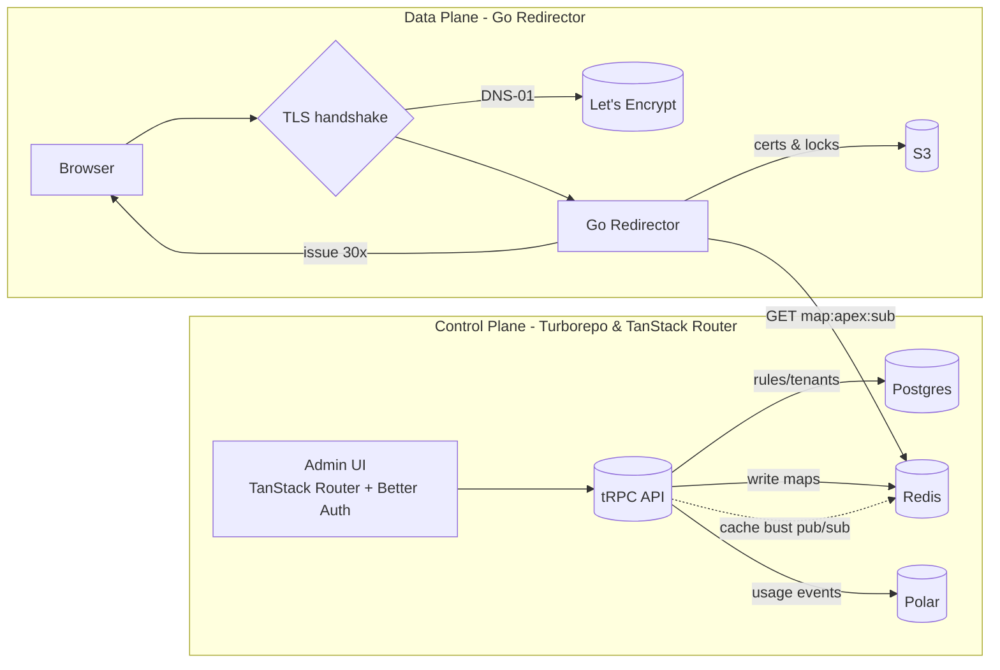
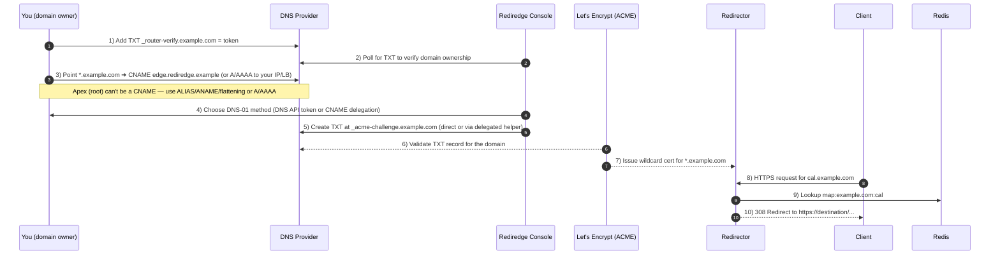

# Rediredge

> **Self‑hosted (or not), production‑minded subdomain redirector with automatic wildcard TLS (DNS‑01), a clean admin, and zero redeploys for changes.**

Point `*.yourdomain.com` at Rediredge, manage `subdomain → destination` rules in a beautiful UI, and let the edge do the rest — safely, fast, and under your control.

**Prefer not to self‑host?** A one‑click hosted version will be available at **[https://rediredge.com](https://rediredge.com)** _(coming soon)_.

> **Status:** 🚧 **Pre‑alpha** — we’re still building; APIs and internals may change. Not production‑ready yet.

---

## Features

### Working toward 0.1 (hosted by us)

- 🚀 Go redirector with host‑based redirects.
- 🔒 Automatic TLS via **CertMagic** + **DNS‑01** wildcards.
- 📦 **S3** cert/lock storage (cluster‑safe).
- 🗃️ **Redis** for rule mappings (hot path).
- 🧭 TXT domain verification flow.
- 🧪 “Test URL” tool in the console (shows matched rule & final Location).
- 💳 Hosted version uses **Polar** for subscriptions (usage‑based billing).
- 🧩 **Turborepo** monorepo: console + redirector in one place.

### Aiming for 1.0 (self‑host release)

- 📦 Docker & Compose quickstarts (console + redirector + Redis + Postgres + MinIO/S3).
- 🔍 Audit log, RBAC, CSV/JSON bulk import/export.
- 📈 Metrics, structured logs, ready‑to‑use dashboards.
- 🧰 Pluggable DNS providers (libdns) + optional ACME CNAME delegation helper.
- 📚 Complete docs for DNS onboarding, rate limits, and troubleshooting.

---

## Onboarding flow (what your users will do)

1. **Verify** domain: add `TXT _router-verify.example.com = <token>`; click “Verify.”
2. **Point traffic**: set `*.example.com` → CNAME to your Rediredge edge (or A/AAAA to your IP/LB).
3. **Choose DNS‑01** method:
   - DNS provider API token (preferred for automation), **or**
   - CNAME delegation for `_acme-challenge` to a helper you (or they) run (planned).

4. **Add rules**: e.g., `cal → https://calendly.com/...` (308), `files` with path/query preservation.
5. **Smoke test**: use **Test URL**; turn on.

---

## Roadmap

- **0.1** — Redirector + DNS‑01 wildcard + S3 storage + Redis rules + TXT verification + minimal console; hosted billing via Polar.
- **0.2** — Bulk import/export, audit log, rule priority, reserved label guardrails, cache bust Pub/Sub.
- **0.3** — Metrics/logging, first‑class docs, Compose quickstart.
- **1.0** — Self‑host release with Docker/Compose, Helm chart, full provider docs, and hardened ops.

---

## What Rediredge is

Rediredge is a two‑part system:

- **Data plane** — a tiny, fast **Go** service that:
  - Terminates TLS automatically for each hostname using **ACME/DNS‑01** and **wildcard certificates**.
  - Reads a `subdomain → URL` mapping from **Redis**.
  - Issues **307/308** redirects (optionally preserving path and query).
  - Shares certificates across instances via **S3** storage (durable, cluster‑safe).

- **Control plane** — a **TanStack Start** app that:
  - Handles admin/auth (**Better Auth**), tenants, domains, and rule CRUD.
  - Verifies domain ownership (TXT).
  - Writes mapping rules to **Redis** (hot path) and configuration to **Postgres**.
  - Integrates billing via **Polar** for the hosted service (usage‑based subscriptions).

---

## Why teams use it

- **Wildcard TLS, zero hassle** — one certificate covers “almost all” subdomains.
- **Subdomain routing without redeploys** — marketing, ops, and support can change links instantly.
- **Self‑hosted by default** — keep your traffic, data, and audit trail in your own infra.
- **Clean path to hosted** — when you don’t want to run it, we’ll run it for you.

---

## Monorepo (Turborepo)

We use **Turborepo** to manage the console (TanStack Router), documentation, and the redirector (Go, planned) in one repo.

```text
/
├─ apps/
│  ├─ web/              # TanStack Router app (console UI + API)
│  ├─ fumadocs/         # Documentation site
│  └─ redirector/       # Go data plane (CertMagic, DNS‑01, Redis) - PLANNED
├─ packages/
│  ├─ api/              # Shared tRPC API logic and routers
│  ├─ auth/             # Better Auth configuration and utilities
│  └─ db/               # Drizzle schema, migrations, and database utilities
├─ infra/
│  ├─ docker/           # Dockerfiles and compose examples - PLANNED
│  └─ k8s/              # Helm charts - PLANNED
├─ LICENSE
└─ turbo.json / package.json / bunfig.toml
```

**Common Turborepo commands**

```bash
# install deps
bun install

# run all apps in dev mode
bun run dev

# run only the console (web app) in dev mode
bun run dev:web

# build all apps
bun run build

# type checking across workspace
bun run check-types

# database commands (using the db package)
bun run db:push      # Push schema changes
bun run db:studio    # Open Drizzle Studio
bun run db:generate  # Generate migrations
bun run db:migrate   # Run migrations
bun run db:start     # Start local Postgres (Docker)
bun run db:watch     # Watch for schema changes

# format & lint
bun run check        # Run Biome formatter/linter
```

---

## Components

### 1) Redirector (Go)

- **TLS**: CertMagic with **on‑demand** issuance and **DNS‑01** wildcards.
- **Storage**: Certs/locks in **S3** (or S3‑compatible like MinIO) for multi‑instance coordination.
- **Mappings**: `map:<apex>:<sub>` → `{"to","status","preservePath","preserveQuery"}` in **Redis**.
- **Redirect codes**: sensible defaults (**308** permanent, **307** temporary), user‑selectable per rule.
- **Safety**: destination scheme allow‑list (`https`, `http`), loop‑prevention, fallback (404/410).
- **Performance**: in‑process LRU cache + keep‑alives; no control‑plane call on the hot path.
- **Ports**: `:443` (TLS); optional `:80` to 301 → HTTPS.

### 2) Console (TanStack Router, Better Auth, Polar, Postgres)

- **Framework**: **TanStack Router** for type-safe routing and data loading.
- **Auth**: **Better Auth** for sessions and RBAC.
- **Data**: **Postgres** (via Drizzle ORM) for orgs, domains, rules metadata, audit; **Redis** for hot-path mappings.
- **Billing**: **Polar** (hosted only) for subscriptions & usage metering.
- **Tools**: Rule editor with preserve path/query toggles; **"Test URL"** to preview matches & final Location.
- **API**: **tRPC** endpoints to manage domains, mappings, and verification.

---

## Rules & semantics

- **Status codes:** default **308** (permanent) and **307** (temporary) — both preserve the HTTP method and body.
- **Preserve path** / **preserve query**: configurable per mapping.
- **Precedence:** exact match wins; then wildcard patterns (future); otherwise fallback (404/410).
- **Reserved labels:** guidance for `mail`, `autodiscover`, `mx` to avoid breaking mail/SSO DNS.

**Example mapping**

```json
{
  "map:example.com:cal": {
    "to": "https://calendly.com/acme",
    "status": 308,
    "preservePath": false,
    "preserveQuery": true
  }
}
```

---

## Architecture at a glance



---

## How DNS & TLS work (plain English)



**Key facts**

- **Wildcard certificates** require **DNS‑01** validation.
- `*.example.com` matches most **one‑label** subdomains (`foo.example.com`) but not multi‑label (`a.b.example.com`); explicit DNS records beat the wildcard.
- The **apex (root)** cannot be a CNAME by DNS rules; many providers offer **ALIAS/ANAME** or **CNAME flattening** to emulate it.

---

## Docker images (planned)

- Redirector: `ghcr.io/leotrapani/rediredge-redirector`
- Console: `ghcr.io/leotrapani/rediredge-console`

Self‑hosters can run both images with **Redis** + **Postgres** + **S3** (or MinIO) using the upcoming `docker-compose.yml`.

---

## License & project info

- **License:** [MIT](./LICENSE)
- **Author:** Built by **Leonardo Trapani** — **[ciao@leotrapani.com](mailto:ciao@leotrapani.com)**
- **Contact:** feedback & security reports welcome via email

---

## FAQ (early)

**Do I need to give you DNS API access?**
No — for teams that can’t share tokens, we’ll support **ACME CNAME delegation** so renewals happen without ongoing API access.

**Can I redirect the apex (`example.com`) too?**
Yes, but DNS rules mean the apex isn’t a CNAME. Use **ALIAS/ANAME/flattening** at your DNS provider or direct A/AAAA.

**What about multi‑label subdomains (`a.b.example.com`)?**
A wildcard `*.example.com` won’t catch `a.b.example.com`. You can add more specific wildcard(s) or explicit records.

**Which redirect code should I choose?**
Use **308** for permanent, **307** for temporary — both preserve method/bodies. Use 301/302 only if you know you don’t care about method changes.

---

## Security & ops defaults

- **No HSTS by default** (you own your own domains).
- **Scheme allow‑list** (`https`, `http`), loop‑prevention.
- **Rate limits** & issuance throttles (planned).
- **Admin endpoints** (health/metrics) run privately; hosted mode uses service‑to‑service auth.

---

> **Heads‑up**: Quickstarts and deployment guides are coming. In the meantime, feel free to email **[ciao@leotrapani.com](mailto:ciao@leotrapani.com)** with questions or early access requests.
