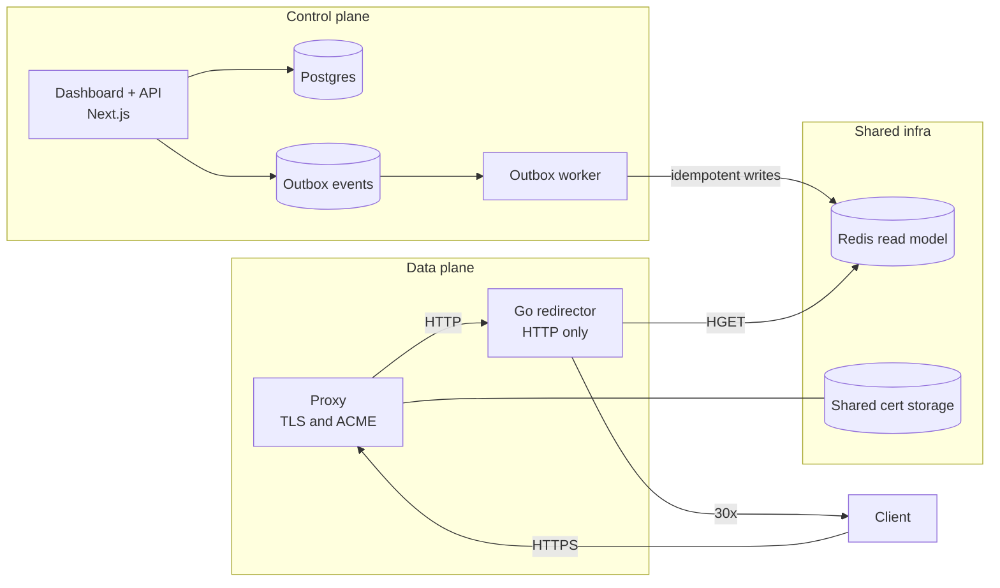
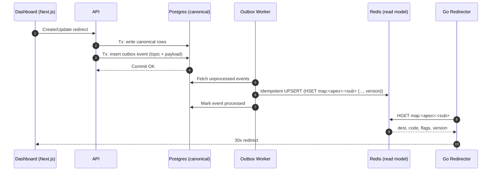

# Rediredge

**Blazing‑fast, self‑hostable domain redirector.**

> **Status:** Pre‑alpha — interfaces and storage schemas may change.

---

## Highlights

* **Instant redirects, zero cold starts.** A tiny Go redirector returns 30x in a single lookup.
* **Automatic HTTPS (proxy‑managed).** A front proxy handles TLS and ACME (on‑demand issuance and DNS‑01 wildcards).
* **Easy to self‑host.** One‑command **Docker Compose** templates; multiple templates will be available.
* **Hosted or self‑hosted.** Use our **hosted, horizontally‑scaled** service (no setup), or run it yourself for free.
* **Simple & powerful.** Clean Next.js dashboard & API, 307/308 method‑preserving redirects, path/query controls.
* **Portable & open.** Docker‑friendly, cloud‑agnostic, MIT‑licensed.

---

## What is Rediredge?

Rediredge pairs a **Go data plane** with a **Next.js control plane**. The control plane manages users, domains, and redirect rules; the data plane serves production traffic with a front proxy for TLS and a tiny Go service that issues instant 30x responses.

* **Data plane (edge):**

  * **Front proxy (default: Caddy)** — terminates TLS, obtains & renews certificates (ACME), and forwards HTTP to the app.
  * **Go redirector** — reads a compact lookup model from Redis and returns the redirect immediately.
* **Control plane (dashboard & API):**

  * **Next.js** app for auth, domains, and redirects; persists canonical configuration and publishes a read‑optimized view for the edge.

---

## Architecture



**Principles**

* The dashboard/API is **never on the hot path** for visitor traffic.
* Canonical config lives in Postgres; the edge reads a compact **Redis** view.
* TLS is managed by the **front proxy**; the Go redirector is **HTTP‑only** and stateless.

---

## Deploying Rediredge

### 1) Hosted (no setup)

Use our **hosted, horizontally‑scaled** service. We operate a proxy tier that manages TLS/ACME and a fleet of Go redirectors. You bring your domains; we handle the rest (billing via Polar). Self‑hosting remains free.

### 2) Self‑host (Docker Compose)

Self‑hosting is **one command**. We’ll ship **multiple templates**; the default template uses a front proxy in front of the Go app.

**Template A — Proxy‑in‑front (default)**

* **What it does**

  * Front proxy terminates TLS and obtains/renews certificates automatically.
  * Go redirector runs HTTP‑only and is fully stateless.
  * Redis stores the read‑optimized redirect map.

* **What you (the operator) add to DNS**

  * **Routing:** Point your domain(s) to the proxy endpoint (subdomains via **CNAME**, apex via **A/AAAA** or **ALIAS/ANAME** depending on your DNS provider).
  * **Optional (wildcards):** Add a **CNAME** for `_acme-challenge.example.com` to the validation hostname we provide (enables automated DNS‑01 issuance/renewals).
  * We’ll provide provider‑specific copy‑paste instructions in the product UI.

* **High availability (optional)**

  * Run multiple proxy instances (sharing certificate storage) and multiple Go instances; put them behind your load balancer. The proxy layer manages renewals; the Go layer scales horizontally.

> Additional templates (Traefik single‑node, Kubernetes with cert‑manager, etc.) will be published as we approach 1.0.

## How syncing works (Postgres → Redis)

We use the **Outbox Pattern** so writes are durable and Redis updates are reliable and idempotent.



**Key guarantees**

* **Idempotence:** each rule carries a `version`; the worker only applies if the incoming version is not older than the stored one.
* **Resilience:** if Redis is down, events remain in the outbox and retry with backoff.
* **Rebuild:** a job can truncate the namespace and repopulate from Postgres at any time.

---

## Redirect rules & semantics

* **Status codes:** default **308** (permanent) and **307** (temporary). Both preserve HTTP method and body.
* **Path & query:** choose to preserve or rewrite; apex and subdomains supported.
* **Precedence:** exact host match wins; (future) wildcard rules come next; otherwise 404/410.
* **Reserved labels:** avoid system records like `mail`, `mx`, `autodiscover` if your DNS uses them.

**Example (conceptual)**

```json
{
  "map:example.com:cal": {
    "to": "https://calendly.com/acme",
    "status": 308,
    "preservePath": false,
    "preserveQuery": true,
    "enabled": true,
    "version": 3
  }
}
```

---

---

## Certificate lifecycle (proxy‑managed)

* **Issuance & renewal:** The **front proxy** performs ACME challenges and renewals automatically.
* **On‑demand TLS (optional):** Approve issuance at first handshake via a lightweight **ask endpoint** (we expose this in the control plane). Great for “just point DNS” onboarding.
* **Wildcards:** Supported via **DNS‑01** (optional `_acme-challenge` CNAME delegation). Useful to cover any subdomain without re‑issuing.
* **Storage:**

  * **Single‑node self‑host:** local filesystem volume.
  * **HA self‑host / hosted:** shared storage for certificates (e.g., Redis/S3 backing, or Secrets in Kubernetes).
* **Security:** Keys are stored by the proxy; use encrypted storage and least‑privilege access. Your Go app never touches private keys.

---

## Scaling & availability

* **Horizontally scalable by design.**

  * Scale the **proxy tier**: add more instances; they share certificate storage and terminate TLS.
  * Scale the **Go tier**: add more redirectors; they are stateless and read from Redis.
* **Multi‑region (optional):**

  * Deploy proxy + Go in multiple regions; put a DNS policy (e.g., latency‑based) in front.
  * No anycast required for v1; the system still works great from a single region.

---

## Tech & development

* **Edge:** Front proxy (TLS + ACME + forwarding), Go redirector, Redis read model.
* **Control:** **Next.js** dashboard, auth, domains & redirects; Postgres (canonical), outbox worker → Redis (read).
* **Monorepo:** Turborepo; Bun scripts for dev/build/lint.

**Common commands**

```bash
# install deps
bun install

# dev (Next.js + worker + edge if configured)
bun run dev

# build all
bun run build

# types across workspace
bun run check-types

# database (Drizzle)
bun run db:push
bun run db:studio
bun run db:generate
bun run db:migrate
```

---

## Roadmap

* **0.1 (hosted preview):** core redirector, dashboard (Next.js), TXT domain verification, usage metering → Polar billing; **self‑host Docker Compose template (proxy‑in‑front)**.
* **0.2:** additional self‑host templates (Traefik single‑node; Kubernetes with cert‑manager), rebuild job, usage analytics pipeline, basic metrics export.
* **0.3:** organizations/workspaces, audit log, bulk rules import.
* **1.0:** full docs, stable product.

> Roadmap is indicative; items may shuffle as we gather feedback.

---

## Coming before 1.0 — other proxy options

We default to a proxy‑in‑front pattern and will ship **multiple templates**:

* **Traefik (single‑node):** easiest for small self‑hosts; ACME/renewal into a local `acme.json`. Not HA by itself.
* **Kubernetes (Traefik or NGINX) + cert‑manager:** cert‑manager handles ACME (incl. DNS‑01); certs live in **Secrets**; scale proxies/redirectors freely.
* **Nginx / HAProxy family:** classic stacks using Certbot or acme.sh. Great single‑node story; for HA, share cert storage or use K8s + cert‑manager.

Each template includes:

* DNS instructions (routing + optional `_acme-challenge` delegation),
* health checks and basic observability,
* zero‑downtime rollout guidance.

---

## License

[MIT](LICENSE)
