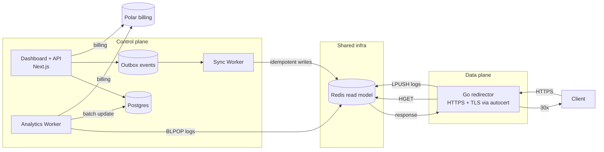

# Rediredge

**Blazing‑fast, self‑hostable domain redirector.**

> **Status:** Pre‑alpha — interfaces and storage schemas may change.

---

## Highlights

* **Instant redirects, zero cold starts.** A tiny Go redirector returns 30x in a single lookup.
* **Automatic HTTPS built‑in.** Go redirector handles HTTPS for all your domains and subdomains directly via autocert—faster, simpler, one binary.
* **Easy to self‑host.** One‑command **Docker Compose** templates; multiple templates will be available.
* **Hosted or self‑hosted.** Use our **hosted, horizontally‑scaled** service (no setup), or run it yourself for free.
* **Simple & powerful.** Clean dashboard & API, 307/308 method‑preserving redirects, path/query controls.
* **Portable & open.** Docker‑friendly, cloud‑agnostic, MIT‑licensed.

---

## What is Rediredge?

Rediredge pairs a **Go data plane** with a **Next.js control plane**. The control plane manages users, domains, and redirect rules; the data plane serves production traffic with a single Go service that handles TLS and issues instant 30x responses based on a redis database (for extremely fast lookups).

* **Data plane (edge):**
  * **Go redirector** — handles TLS via autocert, reads a compact lookup model from Redis, and returns the redirect immediately.
* **Control plane (dashboard & API):**
  * **Next.js** app for auth, domains, tracking, and redirects; persists canonical configuration and publishes a read‑optimized view for the edge.

---

## Architecture



**Principles**

* The dashboard/API is **never on the hot path** for visitor traffic.
* Canonical config lives in Postgres; the edge reads a compact **Redis** view.
* TLS is handled directly by the **Go redirector** via autocert (ACME HTTP‑01); the redirector is stateless.
* Redirect analytics are logged asynchronously to Redis; a worker processes them in batches to update the database and Polar billing.
* Syncing via the Sync and Outbox Workers ensures data consistency from Postgres to Redis for configurations.

**Deployment flexibility**

* **Control plane** (Next.js, Postgres, Sync Worker): hosted by us or fully self‑hosted.
* **Data plane** (Go redirector, Redis): hosted by us (paid) or self‑hosted (free/cheaper).
* Self‑hosters run the data plane locally while connecting to our hosted control plane for management.
* Easily **horizontally** scale, just put a load balancer and spin how many instances of the go redirector you want

---

## Deploying Rediredge

### 1) Hosted (no setup)

Use our **hosted, horizontally‑scaled** service. We operate a proxy tier that manages TLS/ACME and a fleet of Go redirectors. You bring your domains; we handle the rest (billing via Polar). Self‑hosting remains free.

### 2) Self‑host (Docker Compose)

Self‑host the **data plane** (redirector) while we manage the **control plane** (dashboard, database, sync). One‑command setup with Docker Compose.

**Architecture**

```
Your Server (self-hosted):
┌──────────────────────────────────┐
│  Go Redirector :5499/5498        │
│  (exposed) - Handles TLS via     │
│  autocert                        │
└────────────────┬─────────────────┘
                 │
            Syncs from...
                 │
┌────────────────┴─────────────────┐
│  Our Hosted Control Plane        │
│                                  │
│  • Next.js Dashboard             │
│  • Postgres (canonical storage)  │
│  • Sync Worker → your Redis      │
└──────────────────────────────────┘
```

**What you get**

* **Go redirector** — Handles HTTPS via autocert (ACME HTTP‑01), stateless service, exposes 5499/5498.
* **Redis** — Stores redirect map, exposed with AUTH for our sync worker.

**Setup**

> **📚 Full deployment guides available [here](/DEPLOY.md)

Run multiple instances of the Go redirector; place them behind your load balancer. Redis can be scaled with replicas or clustering, or some solutions like Upstash.

## How syncing works (Postgres → Redis)

We use the **Outbox Pattern** so writes are durable and Redis updates are reliable and idempotent.

**Key guarantees**

* **Idempotence:** each rule carries a `version`; the worker only applies if the incoming version is not older than the stored one.
* **Resilience:** if Redis is down, events remain in the outbox and retry with backoff.
* **Rebuild:** a job can truncate the namespace and repopulate from Postgres at any time.

---

## Redirect rules & semantics

* **Status codes:** default **308** (permanent) and **307** (temporary), also **301**, **302**. Both preserve HTTP method and body.
* **Path & query:** choose to preserve or rewrite; subdomains only (apex support coming soon).

**Example**

```json
{
  "redirect:example.com:cal": {
    "to": "https://calendly.com/acme",
    "status": 308,
    "preservePath": false,
    "preserveQuery": true,
    "enabled": true,
    "version": 3
  }
}
```

---

## Scaling & availability

* **Horizontally scalable by design.**
  * Scale the **Go tier**: add more redirectors; they are stateless and read from Redis.

* **Multi‑region (optional):**
  * Deploy Go redirectors in multiple regions; put a DNS policy (e.g., latency‑based) in front.
  * No anycast required for v1; the system still works great from a single region.

---

## Tech & development

* **Edge:** Go redirector (TLS + ACME via autocert), Redis read model.
* **Control:** **Next.js** dashboard, auth, domains & redirects; Postgres (canonical), sync worker → Redis (read), analytics worker → Redis (logs).
* **Monorepo:** Turborepo; Bun scripts for dev/build/lint.

**Common commands**

```bash
# install deps
bun install

# dev (Next.js + worker + edge if configured)
bun run dev

# build all (includes Go CLI)
bun run build

# types across workspace
bun run check-types

# Go Redirector (standalone development)
cd redirector
go build -o bin/redirector .
go test ./...

# Go Redirector (Docker Compose - self-hosting)
cd deploy
docker-compose up -d           # Start services
docker-compose logs -f         # View logs
docker-compose down            # Stop services
docker-compose build           # Rebuild after code changes

# database (Drizzle)
bun run db:push
bun run db:studio
bun run db:generate
bun run db:migrate
```

---

## Roadmap

* **0.1 (hosted preview):** core redirector with built‑in TLS, dashboard (Next.js), TXT domain verification, usage metering → Polar billing**.
* **0.1.5**: redirect verification
* **0.2**: self‑hosting  configuration
* **0.3**: metrics dashboard, analytics
* **0.4** additional self‑host templates (Kubernetes), rebuild job, usage analytics pipeline, basic metrics export.
* **1.0:** full docs, stable product.

> Roadmap is indicative; items may shuffle as we gather feedback.

---

## License

[MIT](LICENSE)
